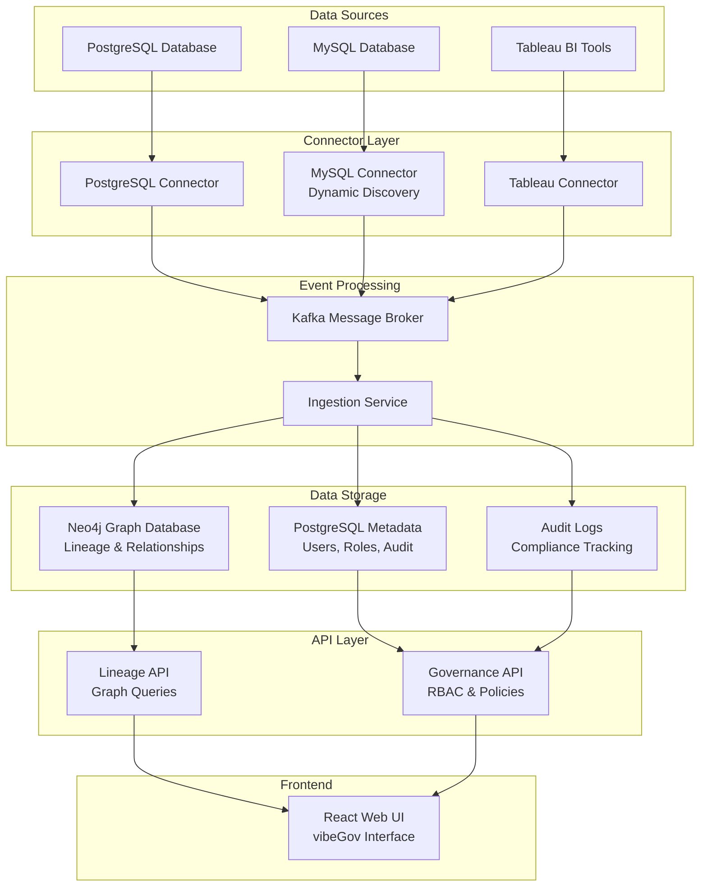

# vibeGov - Data Governance & Lineage Platform

A scalable, enterprise-grade Node.js application for end-to-end data governance and lineage tracking. vibeGov serves as a central source of truth for an organization's data assets, providing a clear, visual map of the data journey across disparate systems.

> **🤖 AI-Generated Application**: This application was developed using AI assistance to demonstrate modern data governance and lineage tracking capabilities. It showcases best practices in microservices architecture, database design, and full-stack development.

## 🏗️ Architecture Overview

vibeGov employs a microservices architecture with the following components:

```
┌─────────────────┐    ┌─────────────────┐    ┌─────────────────┐
│   Web UI        │    │   Governance    │    │   Lineage API   │
│   (React)       │    │   Service       │    │   Service       │
│   Port: 3005    │    │   Port: 3004    │    │   Port: 3003    │
└─────────────────┘    └─────────────────┘    └─────────────────┘
         │                       │                       │
         └───────────────────────┼───────────────────────┘
                                 │
                    ┌─────────────────┐
                    │   Nginx Proxy   │
                    │   Port: 3005    │
                    └─────────────────┘
                                 │
         ┌───────────────────────┼───────────────────────┐
         │                       │                       │
┌─────────────────┐    ┌─────────────────┐    ┌─────────────────┐
│   Connectors    │    │   Ingestion     │    │   PostgreSQL    │
│   Service       │    │   Service       │    │   Database      │
│   Port: 3001    │    │   Port: 3002    │    │   Port: 5432    │
└─────────────────┘    └─────────────────┘    └─────────────────┘
         │                       │
         └───────────────────────┼───────────────────────┐
                                 │                       │
                    ┌─────────────────┐    ┌─────────────────┐
                    │   Kafka         │    │   Neo4j         │
                    │   Port: 9092    │    │   Database      │
                    └─────────────────┘    │   Port: 7474    │
                                           └─────────────────┘
                                 │
                    ┌─────────────────┐
                    │   MySQL         │
                    │   Database      │
                    │   Port: 3306    │
                    └─────────────────┘
```

## ✨ **Key Features**

- **🔍 Data Discovery**: Dynamic asset discovery from PostgreSQL, MySQL, and Tableau
- **📊 Lineage Tracking**: End-to-end data flow visualization with column-level lineage
- **🛡️ Data Governance**: Role-based access control, data classification, and masking rules
- **📈 Real-time Monitoring**: Live data quality checks and schema change detection
- **🔐 Security**: JWT authentication, audit logging, and compliance tracking
- **📱 Modern UI**: React-based interface with interactive lineage graphs
- **🐳 Containerized**: Full Docker support with health checks and monitoring
- **📊 Multi-Database**: Support for PostgreSQL, MySQL, and Neo4j

## 🚀 Quick Start

### Prerequisites

- Docker and Docker Compose
- Node.js 18+ (for local development)
- Git

### 1. Clone the Repository

```bash
git clone https://github.com/samal/vibe-gov.git vibeGov
cd vibeGov
```

### 2. Start All Services

```bash
# Start all services with Docker Compose
docker compose up -d

# Check service status
docker compose ps
```

### 3. Access the Application

- **Web UI**: http://localhost:3005
- **Lineage API**: http://localhost:3005/lineage-api
- **Governance API**: http://localhost:3005/api/v1
- **Neo4j Browser**: http://localhost:7474 (neo4j/lineage123)
- **Kafka UI**: http://localhost:8080

### 4. Verify Installation

```bash
# Check if all services are healthy
docker compose ps

# Test the lineage API
curl http://localhost:3005/lineage-api/lineage/graph

# Test the assets API
curl http://localhost:3005/api/v1/assets
```

## 📊 **Current System Status**

**✅ Fully Operational** - All services running with latest features:

- **Databases**: PostgreSQL 16.10, MySQL 8.0.43, Neo4j 5.x
- **APIs**: Governance, Lineage, Connectors, Ingestion services
- **UI**: React-based Web UI with rebranded vibeGov interface
- **Connectors**: Dynamic MySQL discovery, PostgreSQL metadata, Tableau integration
- **Security**: JWT authentication, RBAC, audit logging
- **Monitoring**: Health checks, real-time logging, performance metrics

## 🔄 **Recent Updates & Improvements**

**Latest Release - vibeGov v1.0.0** 🎉

> **💡 Development Note**: This application was built using AI assistance, demonstrating how modern AI tools can accelerate the development of complex enterprise applications while maintaining high code quality and architectural best practices.

### **Major Enhancements:**
- **🔄 Complete Rebranding**: Renamed from LineageNexus to vibeGov
- **🐬 MySQL Integration**: Real-time dynamic asset discovery from MySQL databases
- **📊 Enhanced UI**: Updated React components with new branding
- **🔍 Dynamic Discovery**: Connectors now automatically discover database schemas
- **📚 Comprehensive Docs**: Step-by-step setup guide and troubleshooting
- **🐳 Docker Optimization**: Improved container health checks and startup sequence

### **Technical Improvements:**
- **Database Support**: PostgreSQL 16, MySQL 8.0, Neo4j 5.x
- **API Enhancements**: Better error handling and response formatting
- **Security**: Enhanced JWT authentication and role-based permissions
- **Monitoring**: Real-time service health monitoring and logging

## 📊 Data Flow Diagram



## 🗄️ **Database Setup & Sample Data**

### **Pre-configured Databases:**
- **PostgreSQL**: Core metadata, user management, audit logs
- **MySQL**: E-commerce sample data (sales, inventory, finance)
- **Neo4j**: Graph relationships, lineage mapping, data quality rules

### **Sample Data Includes:**
- **Users & Roles**: Admin, Data Steward, Engineer, Analyst, Viewer
- **Data Assets**: 20+ tables, views, and reports across systems
- **Classifications**: PII, Financial, Internal, Public, Restricted
- **Lineage**: Cross-system data flows and transformations
- **Governance**: Masking rules, audit trails, compliance policies

### **Quick Data Verification:**
```bash
# Check sample data counts
docker exec -i lineage_postgres psql -U lineage -d lineage -c "SELECT COUNT(*) as users FROM users;"
docker exec -i lineage_mysql mysql -u lineage -plineage -e "USE sales; SELECT COUNT(*) as customers FROM customers;"
docker exec -i lineage_neo4j cypher-shell -u neo4j -p lineage123 "MATCH (n:DataAsset) RETURN count(n) as total_assets;"
```

### **📖 Detailed Database Setup Instructions:**
For complete database initialization, schema setup, and detailed seed data instructions, see:
- **`db/README.md`** - Comprehensive database setup guide
- **`db/init.sh`** - Automated database initialization script
- **`db/postgres/seed.sql`** - PostgreSQL seed data and schema
- **`db/neo4j/seed.cypher`** - Neo4j graph data and relationships
- **`db/mysql/init/`** - MySQL schema and sample e-commerce data

## 🛠️ How to Run vibeGov

### **Step 1: Prerequisites Setup**

#### **Required Software**
- **Docker Desktop** (v20.10+)
- **Docker Compose** (v2.0+)
- **Git** (v2.30+)
- **Node.js** (v18+ for local development)

#### **System Requirements**
- **RAM**: Minimum 8GB, Recommended 16GB
- **Storage**: At least 10GB free space
- **CPU**: 4+ cores recommended
- **OS**: macOS 10.15+, Windows 10+, or Linux

#### **Install Docker Desktop**
```bash
# macOS (using Homebrew)
brew install --cask docker

# Windows
# Download from https://www.docker.com/products/docker-desktop

# Linux (Ubuntu/Debian)
sudo apt-get update
sudo apt-get install docker.io docker-compose
sudo usermod -aG docker $USER
```

### **Step 2: Clone and Setup Repository**

```bash
# Clone the repository
git clone https://github.com/samal/vibe-gov.git vibeGov
cd vibeGov

# Verify the structure
ls -la
# Should show: docker-compose.yml, services/, db/, etc.
```

### **Step 3: Environment Configuration**

#### **Check Docker Status**
```bash
# Ensure Docker is running
docker --version
docker-compose --version

# Start Docker Desktop if not running
# (Launch Docker Desktop application)
```

#### **Verify Port Availability**
```bash
# Check if required ports are free
netstat -an | grep -E ":(3001|3002|3003|3004|3005|5432|7474|7687|9092|3306)"
# If ports are in use, stop conflicting services
```

### **Step 4: Start the System**

#### **Option A: Start All Services at Once**
```bash
# Start all services in detached mode
docker-compose up -d

# Monitor startup progress
docker-compose logs -f
```

#### **Option B: Start Services Gradually (Recommended for First Run)**
```bash
# 1. Start databases first
docker-compose up -d postgres mysql neo4j

# 2. Wait for databases to be healthy
docker-compose ps

# 3. Start Kafka
docker-compose up -d kafka

# 4. Wait for Kafka to be healthy
docker-compose ps

# 5. Start core services
docker-compose up -d governance lineage_api

# 6. Start remaining services
docker-compose up -d connectors ingestion web-ui
```

### **Step 5: Verify System Health**

#### **Check Service Status**
```bash
# View all services and their health
docker-compose ps

# Expected output should show all services as "healthy" or "Up"
```

#### **Check Service Logs**
```bash
# Check for any startup errors
docker-compose logs --tail=50

# Check specific service logs
docker-compose logs postgres --tail=20
docker-compose logs mysql --tail=20
docker-compose logs neo4j --tail=20
```

#### **Test Database Connections**
```bash
# Test PostgreSQL
docker exec -i lineage_postgres psql -U lineage -d lineage -c "SELECT version();"

# Test MySQL
docker exec -i lineage_mysql mysql -u lineage -plineage -e "SELECT VERSION();"

# Test Neo4j
docker exec -i lineage_neo4j cypher-shell -u neo4j -p lineage123 "RETURN 'Neo4j is running' as status;"
```

### **Step 6: Access the Application**

#### **Web Interface**
```bash
# Open in your browser
open http://localhost:3005
# or navigate to: http://localhost:3005
```

#### **API Endpoints**
```bash
# Test Governance API
curl -X POST http://localhost:3004/api/v1/auth/login \
  -H "Content-Type: application/json" \
  -d '{"email":"admin@lineage.com","password":"test123"}'

# Test Lineage API
curl http://localhost:3003/lineage/graph

# Test Connectors API
curl http://localhost:3001/health
```

#### **Database Interfaces**
```bash
# Neo4j Browser
open http://localhost:7474
# Username: neo4j
# Password: lineage123

# PostgreSQL (using psql)
docker exec -it lineage_postgres psql -U lineage -d lineage

# MySQL (using mysql client)
docker exec -it lineage_mysql mysql -u lineage -plineage
```

### **Step 7: Initial Data Setup**

#### **Verify Sample Data**
```bash
# Check PostgreSQL data
docker exec -i lineage_postgres psql -U lineage -d lineage -c "SELECT COUNT(*) as users FROM users;"
docker exec -i lineage_postgres psql -U lineage -d lineage -c "SELECT COUNT(*) as assets FROM data_assets;"

# Check MySQL data
docker exec -i lineage_mysql mysql -u lineage -plineage -e "USE sales; SELECT COUNT(*) as customers FROM customers;"
docker exec -i lineage_mysql mysql -u lineage -plineage -e "USE inventory; SELECT COUNT(*) as products FROM products;"

# Check Neo4j data
docker exec -i lineage_neo4j cypher-shell -u neo4j -p lineage123 "MATCH (n:DataAsset) RETURN count(n) as total_assets;"
```

#### **Login to Web UI**
1. Navigate to http://localhost:3005
2. Click "Login" or navigate to login page
3. Use credentials:
   - **Email**: `admin@lineage.com`
   - **Password**: `test123` (or any password for demo)

#### **📋 Need to Set Up Databases from Scratch?**
If you're starting with empty databases or need to reinitialize:
```bash
# Run the automated database setup script
./db/init.sh

# Or manually run individual scripts:
# PostgreSQL: docker exec -i lineage_postgres psql -U lineage -d lineage < db/postgres/schema.sql
# MySQL: docker exec -i lineage_mysql mysql -u lineage -plineage < db/mysql/init/01-schema.sql
# Neo4j: docker exec -i lineage_neo4j cypher-shell -u neo4j -p lineage123 < db/neo4j/seed.cypher
```

**📖 Full Setup Guide**: See `db/README.md` for detailed instructions

### **Step 8: Explore the System**

#### **Navigate Web UI**
- **Dashboard**: Overview of system status and metrics
- **Data Catalog**: Browse all data assets across systems
- **Lineage Graph**: Visual data flow mapping
- **Governance**: Data classifications, masking rules, audit logs
- **Settings**: System configuration and user management

#### **Test Core Features**
```bash
# 1. Create a new data classification
curl -X POST http://localhost:3004/api/v1/classifications \
  -H "Authorization: Bearer YOUR_TOKEN" \
  -H "Content-Type: application/json" \
  -d '{"key":"TEST","label":"Test Classification","description":"Test"}'

# 2. View lineage graph
curl http://localhost:3005/lineage-api/lineage/graph

# 3. Check audit logs
curl http://localhost:3004/api/v1/audit/events
```

### **Step 9: Troubleshooting Common Issues**

#### **Service Won't Start**
```bash
# Check Docker resources
docker system df
docker system prune -f

# Check service logs
docker-compose logs [service-name]

# Restart specific service
docker-compose restart [service-name]
```

#### **Database Connection Issues**
```bash
# Check if databases are running
docker-compose ps postgres mysql neo4j

# Check database logs
docker-compose logs postgres
docker-compose logs mysql
docker-compose logs neo4j

# Restart databases
docker-compose restart postgres mysql neo4j
```

#### **Port Conflicts**
```bash
# Find what's using a port
lsof -i :3005
lsof -i :5432
lsof -i :3306

# Stop conflicting services or change ports in docker-compose.yml
```

#### **Memory Issues**
```bash
# Check Docker memory usage
docker stats

# Increase Docker Desktop memory limit
# Docker Desktop → Settings → Resources → Memory
```

### **Step 10: Development and Customization**

#### **Local Development Setup**
```bash
# Install dependencies for specific services
cd services/governance
npm install
npm run dev

cd ../web-ui
npm install
npm run dev
```

#### **Modify Database Schema**
```bash
# Edit schema files
vim db/postgres/schema.sql
vim db/mysql/init/01-schema.sql

# Rebuild and restart services
docker-compose down
docker-compose up -d
```

#### **Add New Connectors**
```bash
# Create new connector in services/connectors/src/connectors/
# Add to docker-compose.yml
# Rebuild connectors service
docker-compose build connectors
docker-compose up -d connectors
```

### **Step 11: Production Deployment**

#### **Environment Variables**
```bash
# Create .env file
cp .env.example .env

# Set production values
MYSQL_PASSWORD=strong_password_here
POSTGRES_PASSWORD=strong_password_here
NEO4J_PASSWORD=strong_password_here
JWT_SECRET=your_jwt_secret_here
```

#### **Security Considerations**
- Change default passwords
- Use strong JWT secrets
- Enable SSL/TLS
- Configure firewall rules
- Set up monitoring and logging

#### **Scaling**
```bash
# Scale specific services
docker-compose up -d --scale connectors=3
docker-compose up -d --scale ingestion=2
```

### **Step 12: Monitoring and Maintenance**

#### **Health Checks**
```bash
# Check system health
docker-compose ps

# Monitor resource usage
docker stats

# Check disk space
docker system df
```

#### **Backup and Recovery**
```bash
# Backup PostgreSQL
docker exec lineage_postgres pg_dump -U lineage lineage > backup.sql

# Backup MySQL
docker exec lineage_mysql mysqldump -u lineage -plineage --all-databases > backup.sql

# Backup Neo4j
docker exec lineage_neo4j neo4j-admin dump --database=neo4j --to=/backups/
```

#### **Log Management**
```bash
# View all logs
docker-compose logs

# Follow specific service logs
docker-compose logs -f governance

# Export logs
docker-compose logs > system_logs.txt
```

## 🎯 **Quick Reference Commands**

```bash
# Start system
docker-compose up -d

# Stop system
docker-compose down

# Restart system
docker-compose restart

# View logs
docker-compose logs -f

# Check status
docker-compose ps

# Rebuild specific service
docker-compose build [service-name]

# Access service shell
docker exec -it lineage_[service-name] /bin/bash

# View service logs
docker-compose logs [service-name] --tail=100
```

## 🆘 **Getting Help**

- **Check logs**: `docker-compose logs [service-name]`
- **Service status**: `docker-compose ps`
- **Resource usage**: `docker stats`
- **Documentation**: 
  - `MYSQL_SETUP_SUMMARY.md` - MySQL integration details
  - `db/README.md` - **Database setup and seed data** ⭐
  - `docs/` - Architecture and technical documentation
- **Database Setup**: 
  - `db/init.sh` - **Automated database initialization** 🚀
  - `db/postgres/seed.sql` - PostgreSQL seed data
  - `db/neo4j/seed.cypher` - Neo4j graph data
  - `db/mysql/init/` - MySQL schema and sample data
- **Issues**: Check GitHub issues or create new one
- **Community**: Join discussions in GitHub discussions

---

**🎉 Congratulations!** You now have a fully functional vibeGov system running with real MySQL integration, dynamic asset discovery, and comprehensive data governance capabilities.

---

> **🤖 AI Development Acknowledgement**: This application was developed with the assistance of AI tools, showcasing the potential of AI-assisted development in creating production-ready enterprise applications. The code demonstrates modern development practices, comprehensive documentation, and robust architecture patterns that can serve as a reference for similar projects.
