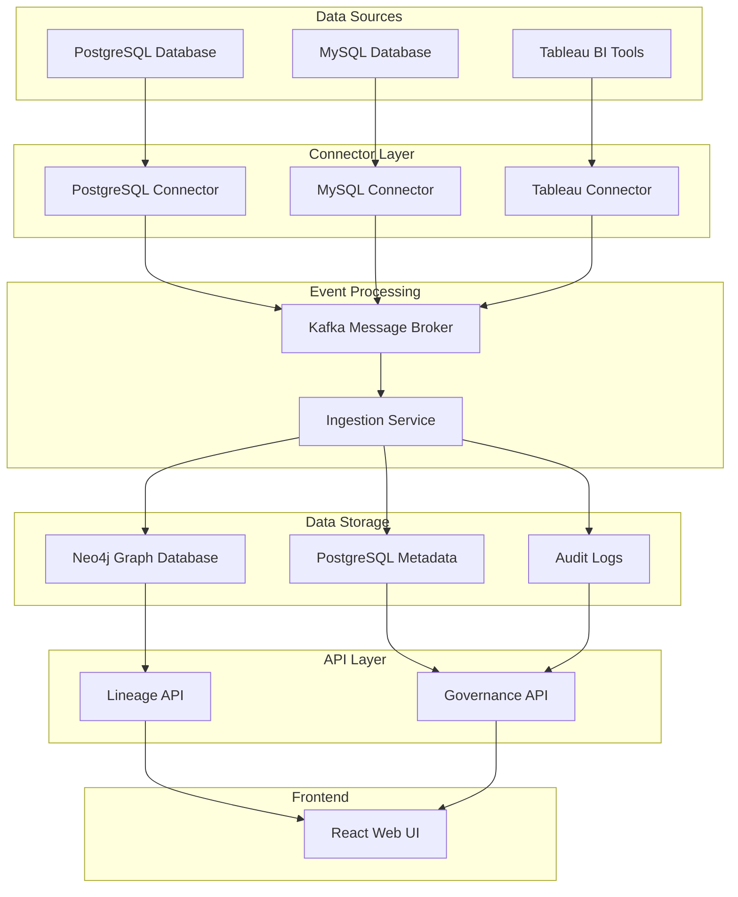

# LineageNexus - Data Governance & Lineage Platform

A scalable, enterprise-grade Node.js application for end-to-end data governance and lineage tracking. LineageNexus serves as a central source of truth for an organization's data assets, providing a clear, visual map of the data journey across disparate systems.

## 🏗️ Architecture Overview

LineageNexus employs a microservices architecture with the following components:

```
┌─────────────────┐    ┌─────────────────┐    ┌─────────────────┐
│   Web UI        │    │   Governance    │    │   Lineage API   │
│   (React)       │    │   Service       │    │   Service       │
│   Port: 3005    │    │   Port: 3004    │    │   Port: 3003    │
└─────────────────┘    └─────────────────┘    └─────────────────┘
         │                       │                       │
         └───────────────────────┼───────────────────────┘
                                 │
                    ┌─────────────────┐
                    │   Nginx Proxy   │
                    │   Port: 3005    │
                    └─────────────────┘
                                 │
         ┌───────────────────────┼───────────────────────┐
         │                       │                       │
┌─────────────────┐    ┌─────────────────┐    ┌─────────────────┐
│   Connectors    │    │   Ingestion     │    │   PostgreSQL    │
│   Service       │    │   Service       │    │   Database      │
│   Port: 3001    │    │   Port: 3002    │    │   Port: 5432    │
└─────────────────┘    └─────────────────┘    └─────────────────┘
         │                       │
         └───────────────────────┼───────────────────────┐
                                 │                       │
                    ┌─────────────────┐    ┌─────────────────┐
                    │   Kafka         │    │   Neo4j         │
                    │   Port: 9092    │    │   Database      │
                    └─────────────────┘    │   Port: 7474    │
                                           └─────────────────┘
```

## 🚀 Quick Start

### Prerequisites

- Docker and Docker Compose
- Node.js 18+ (for local development)
- Git

### 1. Clone the Repository

```bash
git clone <repository-url>
cd lineage
```

### 2. Start All Services

```bash
# Start all services with Docker Compose
docker compose up -d

# Check service status
docker compose ps
```

### 3. Access the Application

- **Web UI**: http://localhost:3005
- **Lineage API**: http://localhost:3005/lineage-api
- **Governance API**: http://localhost:3005/api/v1
- **Neo4j Browser**: http://localhost:7474 (neo4j/lineage123)
- **Kafka UI**: http://localhost:8080

### 4. Verify Installation

```bash
# Check if all services are healthy
docker compose ps

# Test the lineage API
curl http://localhost:3005/lineage-api/lineage/graph

# Test the assets API
curl http://localhost:3005/api/v1/assets
```

## 📊 Data Flow Diagram


